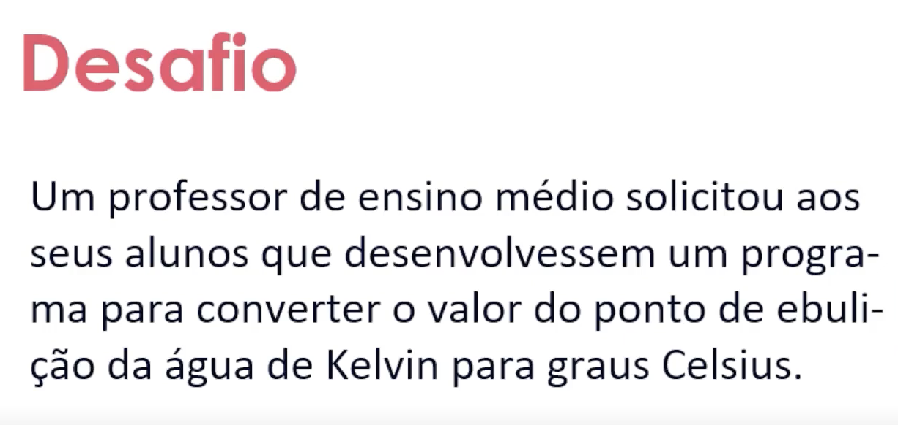

# Projeto 1 - Go Developer 
O seguinte programa resolve o seguinte desafio:



## Pré-requisitos
Certifique-se de que você possui Go instalado em sua máquina. 

[Instale aqui a versão mais recente](https://go.dev/dl/)

No terminal:
```
go version
```

## Instalação

1. Clone o repositório do projeto para sua máquina local:

```
git clone https://github.com/joaquimchianca/dio-golang-proj1.git
```

2. Navegue até o diretório do projeto:

```
cd dio-golang-proj1
```

3. Rode o programa

```
go run main.go
```

> Caso deseje compilar o código para um executável digite `go build main.go`